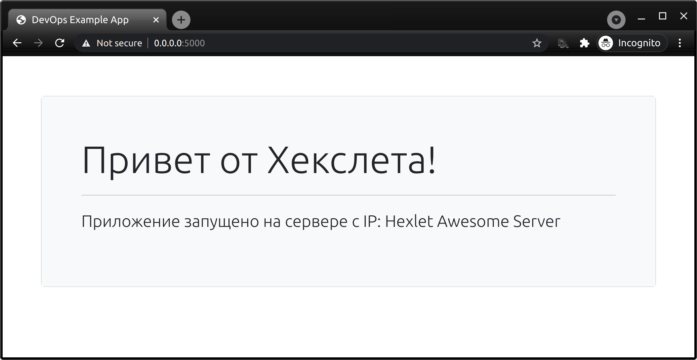

# DevOps example app

 [](https://hub.docker.com/r/hexletcomponents/devops-example-app)

This is a simple node application that shows on the main page server on which it is running and report errors to [Rollbar](https://rollbar.com/).

## Usage

```bash
docker run -p 3000:3000 -e SERVER_MESSAGE="Hexlet Awesome Server" -e ROLLBAR_TOKEN="<your token>" hexletcomponents/devops-example-app
# open http://0.0.0.0:3000 in browser
 ```

## Requirements

* Node 14.x
* Make

## Install

```bash
make setup
```

You may pass environment variable `SERVER_MESSAGE`, and its value shows on the main page.

Edit *.env* file to set up environment variables.

```env
SERVER_MESSAGE="Hexlet Awesome Server"
ROLLBAR_TOKEN=<your token>
```

## Start application

```bash
make start
# open http://0.0.0.0:3000 in browser
```



---

[](https://hexlet.io?utm_source=github&utm_medium=link&utm_campaign=devops-example-app)

This repository is created and maintained by the team and the community of Hexlet, an educational project. [Read more about Hexlet](https://hexlet.io?utm_source=github&utm_medium=link&utm_campaign=devops-example-app).

See most active contributors on [hexlet-friends](https://friends.hexlet.io/).
