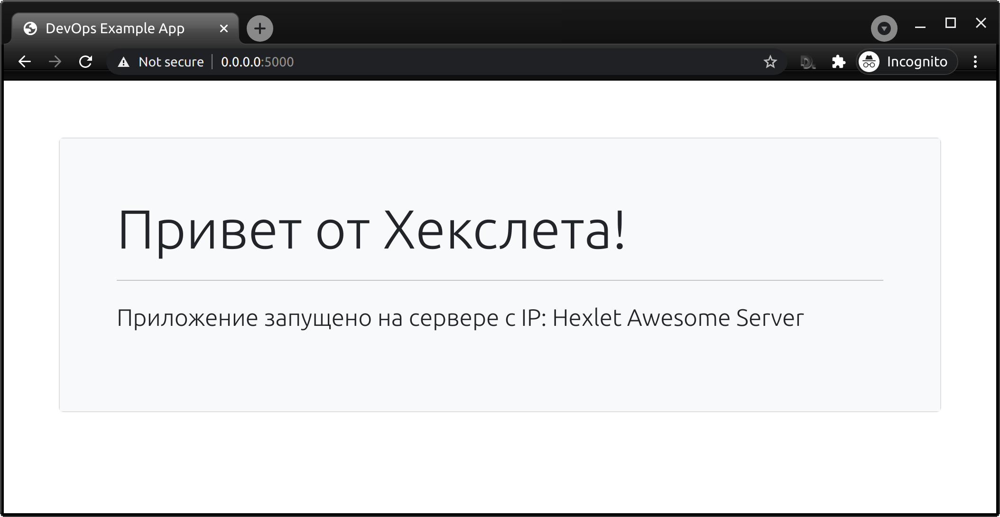

# DevOps example app

 [](https://hub.docker.com/r/hexletcomponents/devops-example-app)

This is a simple node application that shows on the main page server on which it is running and report errors to [Bugsink](https://www.bugsink.com/).

## Зачем это нужно

Приложение-подопытный для курсов по DevOps. На главной странице показывает, на
каком сервере оно запущено, и умеет намеренно падать, отправляя ошибку в
[Bugsink](https://www.bugsink.com/).

Обе особенности сделаны ради упражнений: по выводу имени сервера видно, куда
именно приехал запрос за балансировщиком, а управляемая ошибка нужна, чтобы
посмотреть на мониторинг в работе.

Опубликовано образом `hexletcomponents/devops-example-app`, поэтому в уроках его
запускают, не собирая: этим занимается курс по докеру. Рядом лежит обвязка,
которую в этих курсах и разбирают: `ansible/`, `terraform/`, `docker-compose.yml`.

## Usage

```bash
docker run -p 3000:3000 -e SERVER_MESSAGE="Hexlet Awesome Server" -e SENTRY_DSN="<your dsn>" hexletcomponents/devops-example-app
# open http://0.0.0.0:3000 in browser
 ```

## Requirements

- Docker
- Make
- Node.js >= 20 (для локальной разработки без Docker)

## Install

```bash
make setup
```

You may pass environment variable `SERVER_MESSAGE`, and its value shows on the main page.

Edit _.env_ file to set up environment variables.

```env
SERVER_MESSAGE="Hexlet Awesome Server"
SENTRY_DSN=<your bugsink dsn>
```

## Getting Bugsink DSN

Bugsink runs as a local service via Docker Compose. To get the DSN:

1. Start the services: `make compose`
2. Open <http://localhost:8000> and log in (`admin@example.com` / `admin`)
3. Create a new project
4. Copy the DSN from the project settings — it looks like:
   `http://<key>@bugsink:8000/<project_id>`
5. Add it to your `.env` file:

   ```env
   SENTRY_DSN=http://<key>@bugsink:8000/<project_id>
   ```

6. Restart the app: `docker compose restart app`

## Development

```bash
make test        # запустить тесты
make lint        # проверить код (oxlint)
make lint-fix    # автоисправление (oxfmt + oxlint)
make update-deps # обновить зависимости (ncu -u)
```

## Start application

```bash
make start
# open http://0.0.0.0:3000 in browser
```



---

[](https://hexlet.io?utm_source=github&utm_medium=link&utm_campaign=devops-example-app)

This repository is created and maintained by the team and the community of Hexlet, an educational project. [Read more about Hexlet](https://hexlet.io?utm_source=github&utm_medium=link&utm_campaign=devops-example-app).

See most active contributors on [hexlet-friends](https://friends.hexlet.io/).
